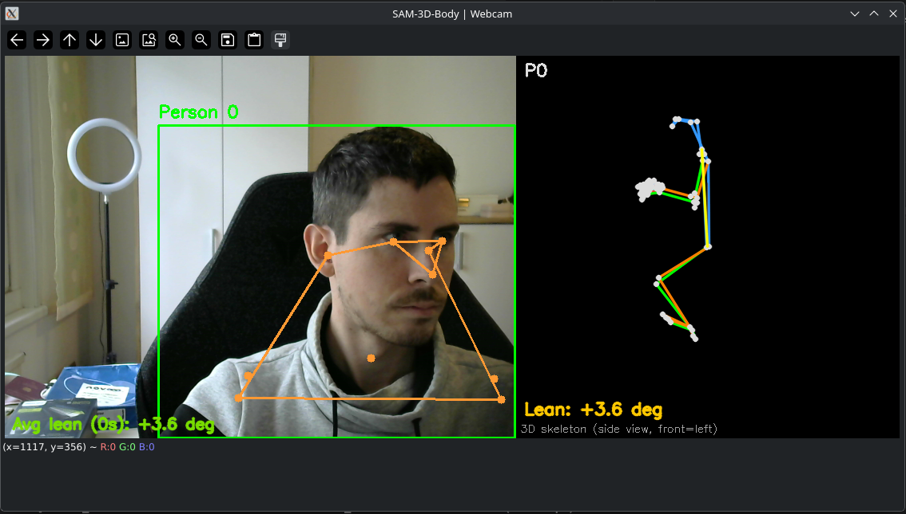

# SAM-3D-Body Demo

Real-time 3D human mesh recovery from webcam, images, and video, built on top of [facebookresearch/sam-3d-body](https://github.com/facebookresearch/sam-3d-body). I built this demo to simply test Sam3D-Body on my machine, see real-time performance and quality of output for inference from a webcam. To give the project some purpose, the demo aims to correct the users posture when sitting at the PC. It estimates the forward leaning angle from the spine to play an audible *beep* when the user is leaning forward too much. 



## Setup

```bash
# Install uv (if not already installed)
curl -LsSf https://astral.sh/uv/install.sh | sh

# Install dependencies and build detectron2
bash setup.sh

# Authenticate with HuggingFace and request model access:
# https://huggingface.co/facebook/sam-3d-body-dinov3
uv run huggingface-cli login
```

## Usage

```bash
# Image
uv run demo.py --input image.jpg

# Video
uv run demo.py --input video.mp4 --output result.mp4

# Webcam (recommended flags for real-time performance)
uv run demo.py --webcam --body-only --tf32 --compile --detector yolo11n.pt
```

## Performance Optimizations

The demo includes several optimizations over the upstream notebook, motivated by profiling on a webcam use case.

### `--body-only`
Skips the two hand decoder forward passes (left and right). With `--body-only`, `run_inference` calls `forward_step` once instead of three times. Hands are not tracked but the full body skeleton (including wrists) is still estimated.

### `--tf32`
Enables TF32 for CUDA matrix multiplications:
```python
torch.backends.cuda.matmul.allow_tf32 = True
torch.backends.cudnn.allow_tf32 = True
```
TF32 uses a 10-bit mantissa internally for dense matmuls while keeping the float32 range. It is a no-op change — no dtype conversions, no sparse op breakage. Free speedup on Ampere+ (RTX 30/40 series).

### `--detector yolo11n.pt`
Replaces the default ViTDet detector (Cascade Mask R-CNN with ViT-H backbone, input size 1024 px) with YOLO11n. The person detector was the dominant bottleneck in the pipeline.

| Detector       | Backbone | Input size | Approx. cost |
|----------------|----------|------------|--------------|
| `vitdet`       | ViT-H    | 1024 px    | very slow    |
| `yolo11n.pt`   | CSPNet   | 640 px     | ~10 ms       |

Any YOLO11/YOLOv8 model name accepted by `ultralytics` works (e.g. `yolo11s.pt` for slightly better accuracy).

### `--compile`
Applies `torch.compile` to the DINOv3 ViT-H backbone after model load. Incurs a one-time compilation cost (~30 s) absorbed by the warmup pass, then reduces per-frame backbone time by ~20–40%.

### `--det-interval N`
Re-runs the person detector every N frames and reuses the bounding box in between. For a mostly stationary subject, `--det-interval 10` or higher is safe. Bypasses the detector cost entirely on N-1 out of every N frames by passing `bboxes=` directly to `process_one_image`.

### Camera intrinsics caching (webcam, always on)
In webcam mode, the FOV estimator (MoGe) runs on the first frame to estimate camera intrinsics, then the result is cached and passed as `cam_int=` to every subsequent call. This skips ~500 ms of MoGe inference per frame after the first.

### CUDA warmup (always on)
A dummy 256×192 black frame is passed through the model immediately after load. This forces CUDA kernel JIT compilation before the first real frame, eliminating the ~2 s spike on the initial inference call.

### SDPA attention (already active, no flag needed)
The loaded checkpoint uses `dinov3_vith16plus` from [facebookresearch/dinov3](https://github.com/facebookresearch/dinov3), which already uses `F.scaled_dot_product_attention` (Flash Attention 2 backend) natively. No modification was needed.

> **Note:** The `vit.py` file in `sam-3d-body/models/backbones/` contains a separate `FlashAttention` class and a `FLASH_ATTN` config key, but these apply only to the `vit`/`vit_l`/`vit_b` checkpoint variants. The `dinov3_vith16plus` checkpoint used here does not go through that code path.

---

## Benchmark

Run on an NVIDIA RTX 4080 Super using `IMG20260114091943.jpg`, 20 timed runs after 5 warmup runs per config.

```bash
uv run benchmark.py
```

RTX 4080 Super, `IMG20260114091943.jpg`, 20 timed runs after 5 warmup runs.
`--no-fov` used for all configs (equivalent to steady-state webcam after first-frame intrinsics cache).

### Cumulative

Each row adds one optimization on top of the previous:

| Config                    |     ms |    ± |   fps | speedup |
|---------------------------|-------:|-----:|------:|--------:|
| baseline (vitdet, full)   | 1061.7 | 11.2 |  0.94 |   1.00x |
| + body-only               |  705.6 |  3.1 |  1.42 |   1.50x |
| + tf32                    |  605.8 |  7.9 |  1.65 |   1.75x |
| + yolo11n                 |  113.9 |  2.1 |  8.78 |   9.32x |
| + compile                 |  107.8 |  2.1 |  9.28 |   9.85x |

### Ablation

Starting from the best config, each row removes one optimization to show its isolated cost:

| Config                       |    ms |    ± |   fps | vs best    |
|------------------------------|------:|-----:|------:|:----------:|
| all optimizations (best)     | 102.9 | 10.1 |  9.71 |    —       |
| w/o compile                  | 112.7 |  0.8 |  8.87 | +9.7 ms    |
| w/o tf32                     | 106.2 |  1.1 |  9.41 | +3.3 ms    |
| w/o body-only                | 464.5 |  1.5 |  2.15 | +361.6 ms  |
| w/o yolo11n                  | 603.6 |  1.6 |  1.66 | +500.7 ms  |

The detector and hand decoding dominate. `tf32` and `compile` are nearly free wins (~3–10 ms each) that are always worth enabling.
